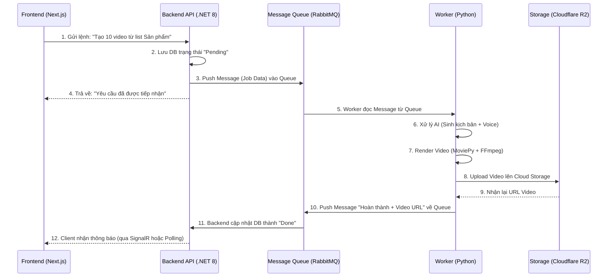

# Kiến Trúc Kỹ Thuật & Tech Stack: Affiliate Automation Suite

Tài liệu này mô tả chi tiết về kiến trúc hệ thống (Polyglot Architecture) và danh sách các công nghệ, thư viện, cùng nền tảng triển khai dự kiến cho dự án Affiliate Automation Suite.

## 1. Tổng Quan Kiến Trúc (Polyglot Architecture)

Hệ thống được chia làm 3 thành phần chính hoạt động độc lập, kết nối với nhau thông qua REST API và Message Queue:
- **Frontend App**: Chịu trách nhiệm giao diện người dùng (UI/UX).
- **Backend API (Nhạc trưởng)**: Xử lý Business logic, quản lý user, gói cước (billing), và điều phối tác vụ.
- **Python Worker (Công nhân)**: Chuyên xử lý các tác vụ nặng (Render Video, gọi API LLM, Auto-posting).

---

## 2. Frontend (Giao Diện Người Dùng)

- **Ngôn ngữ / Framework**: TypeScript / Next.js (React).
- **Thư viện UI**: Tailwind CSS kết hợp Shadcn UI (hoặc Ant Design) để xây dựng Dashboard nhanh gọn, hiện đại và chuyên nghiệp.
- **State Management**: Zustand hoặc Redux Toolkit.
- **Data Fetching**: React Query hoặc SWR.
- **Nền tảng triển khai dự kiến**: 
  - **Vercel** (Khuyên dùng, cực kỳ tối ưu cho Next.js, cấu hình auto-deployment từ GitHub rất dễ).
  - Hoặc tự host bằng VPS/EC2 qua Docker.

---

## 3. Backend (Core API & Orchestrator)

- **Ngôn ngữ / Framework**: C# / .NET 8 (ASP.NET Core Web API).
- **ORM (Tương tác Database)**: Entity Framework Core (EF Core) hoặc Dapper.
- **Authentication (Xác thực)**: JWT (JSON Web Tokens) kết hợp ASP.NET Core Identity.
- **Thư viện giao tiếp Queue**: `RabbitMQ.Client` hoặc `MassTransit` (MassTransit rất mạnh để quản lý Message Broker trong .NET).
- **Nền tảng triển khai dự kiến**:
  - Triển khai bằng **Docker Container** lên máy chủ ảo VPS (chạy Linux/Ubuntu) để tiết kiệm chi phí.
  - Hoặc sử dụng **AWS Elastic Beanstalk** / **Azure App Service** nếu có ngân sách linh hoạt.

---

## 4. Background Worker (AI & Video Processing)

- **Ngôn ngữ**: Python 3.10+.
- **Thư viện xử lý Video / Media**: 
  - `MoviePy`: Bọc lại (wrap) thư viện FFmpeg, giúp việc cắt ghép hình ảnh, video, âm thanh, chèn chữ dễ dàng hơn bằng code Python.
  - Hoặc gọi trực tiếp `ffmpeg-python`.
- **Thư viện AI**: 
  - `openai`, `anthropic` (để gọi API sinh Kịch bản/Text).
  - `edge-tts` (Dịch vụ Text-to-Speech miễn phí của Edge) hoặc `elevenlabs` API (Cao cấp).
- **Thư viện Browser Automation (Tự động đăng bài)**: 
  - `Playwright` cho Python (Nhanh, nhẹ và ít bị phát hiện hơn Selenium).
- **Thư viện Consumer (Lắng nghe Queue)**: `pika` (client kết nối với RabbitMQ) hoặc `Celery` (nếu dùng Redis).
- **Nền tảng triển khai dự kiến**: 
  - Máy chủ (VPS/Dedicated Server) chạy Linux có **cấu hình CPU/RAM lớn** (Ví dụ: Server từ Hetzner hoặc AWS EC2 C-series) để chuyên gánh tác vụ Render Video. 

---

## 5. Cơ Sở Dữ Liệu & Infrastructure (Hạ Tầng)

> **Lưu ý Quan Trọng:** Ở giai đoạn MVP và phát triển ban đầu, hệ thống sẽ áp dụng triệt để **Dependency Injection (DI)** thông qua mô hình Interface (Ví dụ: `IStorageService`, `IQueueService`, `ICacheService`). Việc này giúp sử dụng các công cụ vệ tinh giả lập (Mock) chạy hoàn toàn ở Local, tiết kiệm chi phí setup và dễ dàng switch sang Cloud khi lên Production.

- **Cơ sở dữ liệu chính (RDBMS)**: PostgreSQL hoặc SQL Server (Có thể dùng SQLite/LocalDB cho môi trường Dev).
- **Message Broker (Hàng đợi)**: 
  - **Môi trường Dev (Giả lập)**: Sử dụng **In-Memory Queue** (như `System.Threading.Channels` trong .NET) hoặc lưu Job vào bảng tạm trong SQL.
  - **Môi trường Production**: Switch sang **RabbitMQ** (hoặc Kafka) chỉ bằng cách tiêm (Inject) implementation mới.
- **Caching**: 
  - **Môi trường Dev (Giả lập)**: Sử dụng **In-Memory Cache** (`IMemoryCache` của .NET).
  - **Môi trường Production**: Switch sang **Redis**.
- **Cloud Storage (Lưu trữ file Media)**: 
  - **Môi trường Dev (Giả lập)**: Lưu file video trực tiếp vào thư mục Local trên ổ cứng (ví dụ: `/wwwroot/uploads`), API trả về đường dẫn Local (`http://localhost...`).
  - **Môi trường Production**: Switch sang **Cloudflare R2** hoặc **AWS S3**.

---

## 6. Sơ Đồ Luồng Xử Lý Khái Quát (Workflow)

## 7. Khuyến Nghị Khi Triển Khai
1. **Dockerize toàn bộ**: Ngay từ đầu hãy viết `Dockerfile` và file `docker-compose.yml` cho từng thành phần (Frontend, Backend, Worker, RabbitMQ, PostgreSQL) để đảm bảo môi trường dev và production giống hệt nhau.
2. **Dọn dẹp tài nguyên (Clean up)**: Quá trình render video sẽ sinh ra rất nhiều file rác (âm thanh tạm, ảnh tạm). Cần có script Python tự động xóa các file này trên Worker sau khi upload lên Cloud Storage thành công để tránh lỗi đầy ổ cứng (Disk Full).
3. **Tracking & Logging**: Sử dụng thư viện như Serilog (.NET) và Logging mặc định (Python) đẩy log về một nơi tập trung (như ElasticSearch/Seq) để dễ dàng trace lỗi khi một video render thất bại.
